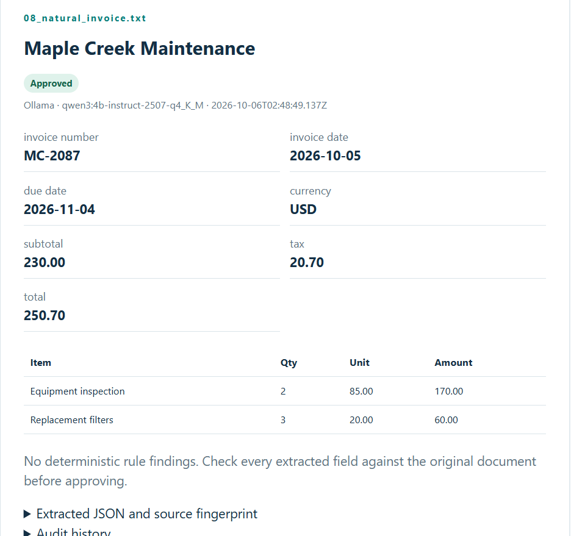
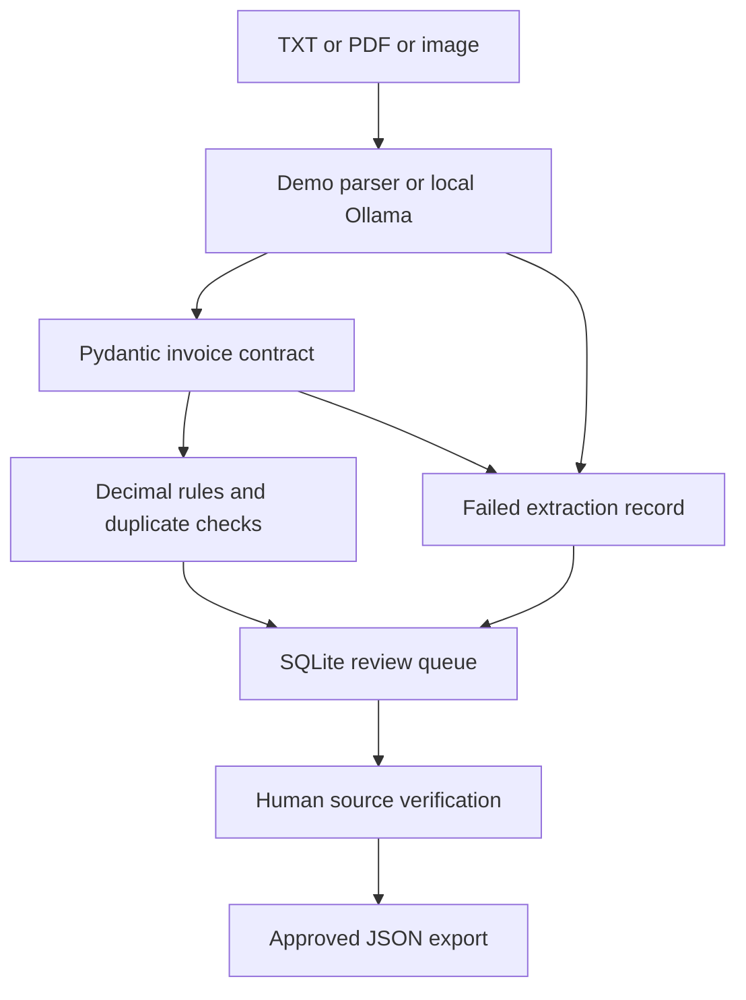

# AI Invoice Intelligence Agent

## Dashboard preview




A Hicks Analytics portfolio project that converts business documents into structured invoice candidates, checks financial rules, detects duplicates, and maintains a human review queue in SQLite.

**Start with the demo below.** It works without Ollama, a paid API, or an API key. The demo parser is deterministic and accepts the supplied labeled format only. Switch to Ollama for actual local AI extraction from varied text, text-based PDFs, or images with a compatible vision model.

## Windows quick start

Extract this folder and open it in VS Code. In the terminal, change into the folder that contains `app.py`:

```powershell
cd C:\Users\hicks\Downloads\ai-invoice-intelligence-agent
py -3 -m venv .venv
.\.venv\Scripts\python.exe -m pip install -r requirements.txt
.\.venv\Scripts\python.exe app.py demo
.\.venv\Scripts\python.exe app.py serve
```

Open **http://127.0.0.1:8766/** on that same computer. Keep the terminal running. Press Ctrl+C to stop the server. Using the venv executable directly avoids PowerShell activation-policy problems. Python 3.11+ is required; 3.12 or 3.13 is a practical choice. If the extracted directory has a different name, use that actual path.

macOS/Linux:

```bash
python3 -m venv .venv
.venv/bin/python -m pip install -r requirements.txt
.venv/bin/python app.py demo
.venv/bin/python app.py serve
```

## What to inspect first

The six fixtures are fictional invoices, not real vendors or financial records.

| Sample | Expected initial result | What it teaches |
|---|---|---|
| 01_clean.txt | Ready for review | Complete invoice with reconciled totals |
| 02_total_mismatch.txt | Needs correction | Printed total differs from subtotal plus tax |
| 03_missing_number.txt | Needs correction | Missing identifiers stay null |
| 04_duplicate.txt | Needs correction | Vendor and invoice number match sample 01 |
| 05_large_amount.txt | Needs correction | USD total meets the configurable $10,000 threshold |
| 06_invalid_amount.txt | Extraction failed | Schema rejects malformed money |

With a fresh database: **6 documents, 4 needing attention for rule findings, 1 failed extraction, 1 ready for review, 0 approved.** The dashboard's Needs attention count includes the failed extraction, so it shows 5. Running `demo` again reuses the same records by content fingerprint.

Select the clean invoice, compare it with its source file, enter your reviewer name and verification note, and approve it. Only that approved record becomes exportable. Records with findings cannot be approved. Reject a bad record and re-upload a corrected source as a new document; this preserves the original and its audit history. An already reviewed record cannot be reviewed again in this MVP.

## Local AI mode

Use your existing Ollama installation and confirm the exact model tag with `ollama list`. The default is the tag used in the Cedarline project; change it if your installed tag differs.

```powershell
ollama list
.\.venv\Scripts\python.exe app.py ingest data\sample_invoices\01_clean.txt --mode ollama --model qwen3:4b-instruct-2507-q4_K_M
```

**If the same file is already in the demo database, it is reused without calling AI.** Compare modes in a separate database:

```powershell
.\.venv\Scripts\python.exe app.py --db data\ai_comparison.sqlite3 ingest data\sample_invoices\01_clean.txt --mode ollama --model qwen3:4b-instruct-2507-q4_K_M
.\.venv\Scripts\python.exe app.py --db data\ai_comparison.sqlite3 serve --port 8767
```

An additional synthetic image fixture, `data/sample_invoices/07_clean_image.png`, is included for testing with a compatible vision model. It represents the same invoice as sample 01, so a business duplicate is expected if both are ingested into the same database.

You can also choose Local AI in the dashboard. The model must be installed locally. Text-only models can handle TXT and text-based PDF inputs. PNG/JPG inputs require a vision-capable model; enter its exact installed tag. Scanned or mixed PDF pages with insufficient text are rejected rather than silently skipped. Export those pages as images for vision extraction. Image/Ollama extraction is implemented but was not tested against a running model in the build environment.

Environment overrides, if needed:

```powershell
$env:OLLAMA_MODEL = "your-installed-model-tag"
$env:OLLAMA_URL = "http://127.0.0.1:11434"
```

The API adapter passes the Pydantic JSON schema to Ollama's `format` parameter. Pydantic checks the response structure; application code checks financial meaning. A valid schema does not prove the values were read correctly. No model-generated confidence percentage is treated as accuracy evidence.

## Architecture



| File | Responsibility |
|---|---|
| src/schemas.py | Nullable extraction fields, date format and money contract |
| src/extract.py | Text/PDF reading, fixture parser, local Ollama request |
| src/validate.py | Missing fields, arithmetic, line totals, date order, threshold |
| src/database.py | Review decisions, normalization, audit events |
| src/pipeline.py | Source fingerprinting, staging, duplicates, approved export |
| app.py | CLI and localhost HTTP dashboard |
| web/ | Responsive dashboard using HTML, CSS and JavaScript |
| tests/ | Financial, storage, extraction and HTTP tests |

## Data contract and scope

Amounts are decimal strings with exactly two fractional digits. Calculations use Decimal and storage uses integer cents. The arithmetic tolerance is one cent. Dates are ISO YYYY-MM-DD. Missing fields use null. Additional schema fields are rejected.

This version supports **USD invoices with subtotal + tax = total**. Missing due dates and missing line items require review. Credit notes, discounts, freight adjustments, complex taxes and other currencies need extensions to the contract and rules. A large invoice threshold is an explicit review policy, not a statistically learned anomaly detector. The default $10,000 is a demo setting, not a universal accounting threshold.

Exact source bytes are deduplicated by SHA-256. Business duplicate checks normalize case, Unicode and whitespace in vendor and invoice number; they deliberately preserve punctuation and leading zeros. Vendor aliases, OCR spelling changes and multi-document invoices can escape that simple match and need a vendor master/fuzzy matching extension. Non-rejected schema-valid records reserve the business key, even if they need correction. Reject the superseded record before ingesting its corrected replacement.

All records are staging candidates, not posted invoices. Approvals require a reviewer and note. SQLite audit events are application history, not a tamper-proof compliance ledger. There is no user authentication; the app binds to localhost and must not be exposed as a public client portal. The current version does not retain the original upload bytes; keep source files in your approved local folder and use the stored filename and fingerprint to match them. Raw extraction data remains in the database and is excluded from git.

## CLI reference

```powershell
.\.venv\Scripts\python.exe app.py --help
.\.venv\Scripts\python.exe app.py list
.\.venv\Scripts\python.exe app.py ingest path\invoice.pdf --mode ollama --model your-tag
.\.venv\Scripts\python.exe app.py ingest path\invoice.txt --threshold 500000
.\.venv\Scripts\python.exe app.py export --out data\approved_invoices.json
.\.venv\Scripts\python.exe -m unittest discover -s tests -v
```

`--threshold` is in cents (500000 = $5,000). `--db` goes before the subcommand. Upload limit: 10 MB. PDF limit: 10 pages. Text limit: 60,000 characters. Inputs are rejected rather than truncated.

## Learning path for today

1. Run the fixtures and explain why each result belongs in its queue state.
2. Read `Invoice` in schemas.py and trace one missing field through validation.
3. Add a new invoice fixture with a line math error and predict the findings before running it.
4. Compare the deterministic parser with Ollama in the separate database. Compare extracted values with the source; record exact-field accuracy and review time instead of relying on model self-reported confidence.
5. Explain the pipeline to a client: documents become checked records; humans resolve exceptions; approved data supports reporting and later automation.

## Next implementation steps

- Add corrections with field-level source evidence and a revalidation audit trail.
- Benchmark extraction on a labeled dataset including scans, ambiguous dates and layouts.
- Add vendor master matching, credit notes and currency-specific minor units.
- Add original-file retention and a source document viewer.
- Connect approved records to a reporting model; keep accounting writes separately authorized.

## GitHub publication

The package is GitHub-ready; it has not been published to your account. From the project folder, create a repository and push when you are ready. Publish only the supplied synthetic fixtures. Do not commit your SQLite database or private client inputs.

## Technical references

- Ollama structured outputs: https://docs.ollama.com/capabilities/structured-outputs
- Ollama vision: https://docs.ollama.com/capabilities/vision
- Pydantic validators: https://docs.pydantic.dev/latest/concepts/validators/

## Build verification

See BUILD_VERIFICATION.md for the checks performed on the packaged version and what still needs local model verification.


## Verified local results

Tested on Windows with local Ollama and qwen3:4b-instruct-2507-q4_K_M.

- All 21 automated tests pass.
- Manually verified extraction from labeled text, natural-layout text, and a text-based PDF.
- Confirmed review findings for incorrect totals, missing identifiers, duplicate invoices, large amounts, and unreadable totals.
- Verified human approval and export of approved records.
- Added current-date context to address a false date warning.

These are synthetic sample checks, not a production accuracy benchmark.
Image extraction with a vision model remains unverified.
